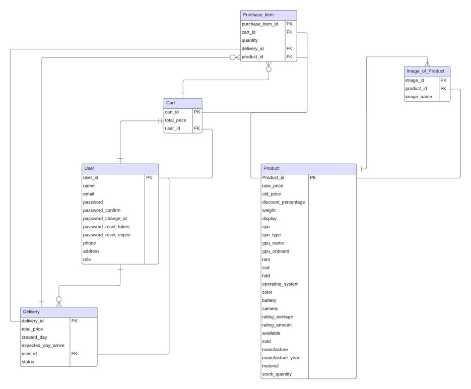

# DB_Lab

## Project Introduction
This is my project for the database lab course at HUST. 
In this project we have built an website of a pc shop which is inspired from an existed website. 

### Features on website
1. User Registration and Accounts
2. Product Catalog
3. Shopping Cart
4. Checkout Process
5. Order Management 

### Database Design

#Set up project
- Import library: npm i
- Run project: npm start 

## Project run at localhost:8000

